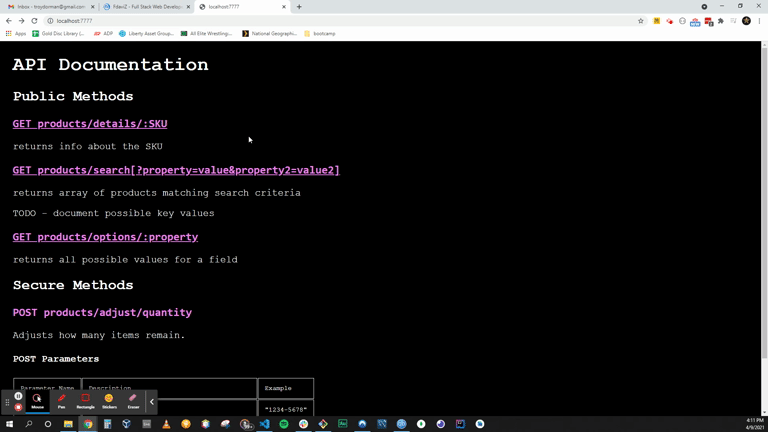

# REST API Demo: Database of Products

We've been working with API's for a while, but only as a consumer of data from public services.  This small project attempts to build a REST API CDN and serve basic JSONS objects from requests users make. 

> Search products by Graph Query

> Search by min / max price

> Get product details
    > Only get needed details
    > Product details:
        - Name
        - Price
        - Brand
        - Sale Price

> Support multiple product variations -
    >  i.e., blue shirt, orange shirt not entirely different products

#WORKFLOW
1. INit NPM Package
2. Configure webpack
3. Generate products
4. Get the Db up and running
5. Script to add products to DB
6. Create express file
7. Required of express API
   1. Get products by brand (not detailed)
   2. Get products by type (every dimension)
   3. reduce product quantity
   4. get single product detail
8. Add POST method

#POSSIBLE ADDITIONAL FEATURES (or possible scope creep)
1. Include POST method
    - Much harder to test, but important
    - Not a skill developer can be without
2. Include secure route